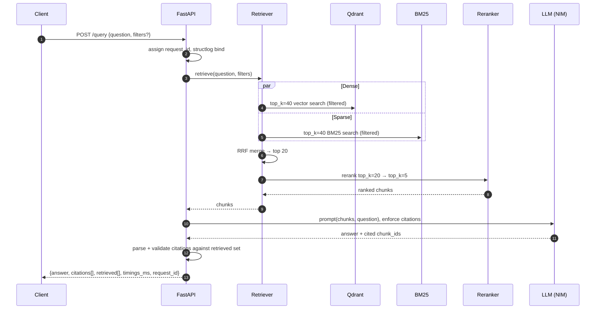

# Architecture

## Components

| Layer        | Tech                                     | Responsibility                                   |
|--------------|------------------------------------------|--------------------------------------------------|
| Ingestion    | httpx, selectolax                        | Pull 10-Ks from SEC EDGAR, parse to text + meta  |
| Chunking     | hand-rolled, Item-aware                  | Split with overlap; preserve section metadata    |
| Embeddings   | sentence-transformers (`bge-small-en`)   | 384-dim L2-normalized dense vectors              |
| Vector store | Qdrant 1.12                              | ANN search with payload filter (company/year/item) |
| Sparse index | rank_bm25                                | BM25 over the same chunks; financial-aware tokenizer |
| Fusion       | Reciprocal Rank Fusion (k=60)            | Merge dense + BM25 hits, rank-based              |
| Rerank       | cross-encoder/ms-marco-MiniLM-L-6-v2     | Re-score top-20 → final top-5                    |
| Generation   | NVIDIA NIM (OpenAI-compatible)           | Answer with citation contract; abstain on insufficient context |
| API          | FastAPI + uvicorn                        | `/query`, `/health`, `/sources/{id}`, `/metrics` |
| Observability| structlog, prometheus-client             | JSON logs + per-stage latency histograms         |

## ASCII fallback diagram

```
                ┌──────────────────────────────────────────┐
                │            Ingestion (offline)           │
SEC EDGAR ────► │  download → parse HTML → Item-aware      │
                │            chunker (with overlap)        │
                └──────────────────────┬───────────────────┘
                                       │
                                       ▼
                ┌──────────────────────────────────────────┐
                │             Indexing (offline)           │
                │   ┌──────────────┐    ┌──────────────┐   │
                │   │   bi-encoder │    │   BM25       │   │
                │   │  embeddings  │    │  rank_bm25   │   │
                │   └──────┬───────┘    └──────┬───────┘   │
                │          │                   │           │
                │   ┌──────▼─────┐      ┌──────▼─────┐     │
                │   │  Qdrant    │      │ index.pkl  │     │
                │   │ collection │      │ on disk    │     │
                │   └────────────┘      └────────────┘     │
                └──────────────────────────────────────────┘

                ┌──────────────────────────────────────────┐
                │              Serving (online)            │
   POST /query ►│  request_id  ─►  hybrid retrieve         │
                │                  ├─ dense (Qdrant)       │
                │                  ├─ sparse (BM25)        │
                │                  └─ RRF fusion           │
                │                          │               │
                │                          ▼               │
                │                  cross-encoder rerank    │
                │                          │               │
                │                          ▼               │
                │                  LLM (NVIDIA NIM)        │
                │                  citation-enforced       │
                │                          │               │
                │                          ▼               │
                │                  citation parser         │
                │                  drops hallucinated ids  │
                │                          │               │
                │                          ▼               │
                │              Answer + validated citations│
                └──────────────────────────────────────────┘
```

## Request flow



## Data model

| Type            | Fields                                                                           |
|-----------------|----------------------------------------------------------------------------------|
| `FilingDoc`     | `company`, `company_name`, `year`, `cik`, `accession`, `source_url`, `text`, `sections[]` |
| `Section`       | `item`, `title`, `start`, `end` (char offsets into `FilingDoc.text`)             |
| `Chunk`         | `id` (`{ticker}-{year}-{item}-{ordinal:04d}`), `text`, `company`, `year`, `item`, `section_title`, `char_start/end`, `token_count`, `source_url` |
| `RetrievedChunk`| `chunk_id`, `score`, `payload`, `source` (`dense` / `sparse` / `hybrid` / `reranked`) |
| `Citation`      | `chunk_id`, `score`, `quote` (optional)                                          |
| `Answer`        | `text`, `citations[]`, `model`, `request_id`                                     |

## Configuration

All runtime config lives in `.env` and is parsed by `core.config.Settings`
(`pydantic-settings`). No keys are read from anywhere else; nothing is
hardcoded. See [.env.example](../.env.example) for the full surface.

## Observability contract

Every request gets a `request_id` (UUIDv4, or honored from inbound
`X-Request-ID`) bound to the structlog `contextvars` at middleware time, so
*every* log line within that request carries the id without explicit
plumbing. The id round-trips back as a response header and inside the
response body.

`/metrics` exposes:

| Metric                                      | Type      | Labels             |
|---------------------------------------------|-----------|--------------------|
| `rag_requests_total`                        | counter   | `endpoint`, `status` |
| `rag_request_latency_seconds`               | histogram | `endpoint`         |
| `rag_retrieval_latency_seconds`             | histogram | —                  |
| `rag_generation_latency_seconds`            | histogram | —                  |
| `rag_llm_tokens_total`                      | counter   | `kind` (prompt/completion) |
| `rag_rate_limited_total`                    | counter   | —                  |

Histogram buckets: `(0.05, 0.1, 0.25, 0.5, 1.0, 2.5, 5.0, 10.0, 30.0)` —
tuned for an RAG workload where retrieval is 100–800 ms and generation is
500 ms – 5 s.

`/sources/{id}` is normalized to `/sources/{id}` in the `endpoint` label so
per-id paths don't blow up label cardinality.

## Failure-mode contract

| Condition                          | Behavior                                              |
|------------------------------------|-------------------------------------------------------|
| `data/bm25/index.pkl` missing      | App boots; `/health` reports `bm25=false`, `/sources` 503, `/query` returns retrieval with 0 sparse hits |
| Qdrant unreachable                 | App boots; `/health` reports `qdrant=false`; `/query` 5xx on dense call |
| `NVIDIA_API_KEY` empty             | App boots with a sentinel LLM; `/query` 503 with a clear `detail` message |
| EDGAR rate-limited / unreachable   | Ingestion auto-falls back to `data/sample/` and continues |
| Model emits hallucinated citation  | Citation parser drops the bad id from `Answer.citations`; the prose is unchanged |
| Rate limit exceeded                | 429 + `rag_rate_limited_total` increment              |
